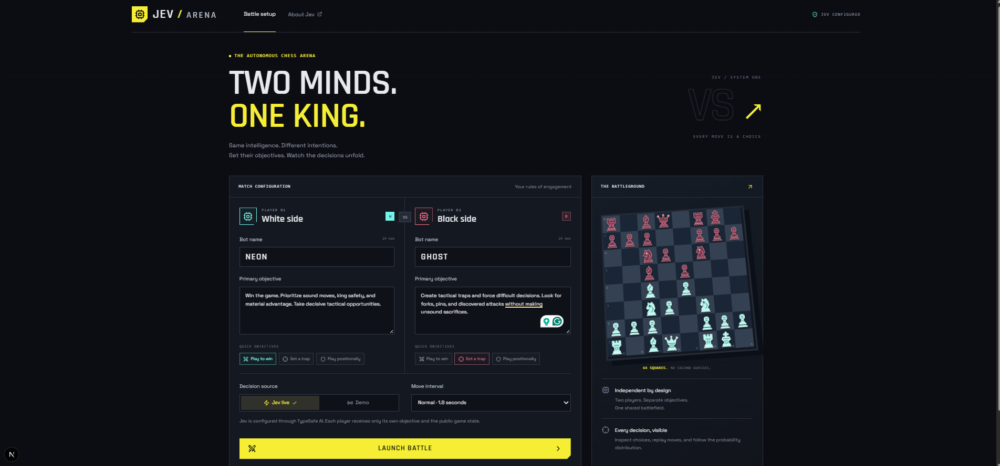
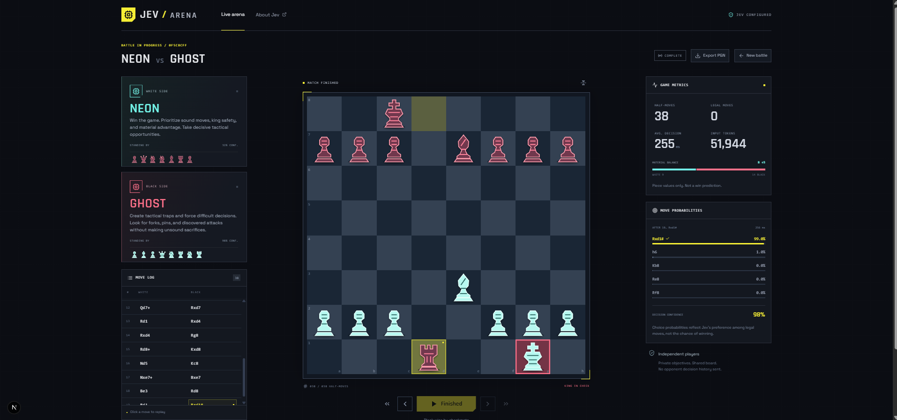

# JEV / ARENA

## Chess duel between two AI players on the same board

JEV Arena is a browser-based chess simulator where two independent players, each with their own name and objective, compete against each other in real time. Instead of one engine controlling both sides, the app gives each side its own context, legal-move constraints, and decision source, so the match feels like a duel between two distinct AI opponents rather than a single autopilot.

The project is built with Next.js, TypeScript, chess.js, and a custom battle loop powered by TypeSafe AI. It is designed for experimentation: you can run a live match with Jev, replay previous turns, inspect probabilities, and see how different objectives shape the way each player responds to the same position.

### Example matches





This app is about exploring how two autonomous agents can play chess under different goals and decision rules, while still following the exact rules of the game and preserving a clean, player-friendly UI.

## Run locally

Requires Node.js 22+ and npm.

```sh
npm install
```

On a fresh checkout, copy `.env.example` to `.env` and generate `SESSION_SECRET` with `node -e "console.log(require('node:crypto').randomBytes(32).toString('hex'))"`. Preserve your existing session secret when updating a local installation. Create an API key in the [TypeSafe AI dashboard](https://console.typesafe.ai/keys) and configure:

```dotenv
TYPESAFE_API_KEY=your-typesafe-key
JEV_MODEL=jev-latest
```

The app connects directly to TypeSafe AI and uses your TypeSafe account's API access. `.env` is ignored by Git. Never expose the API key or session secret through `NEXT_PUBLIC_` variables. When migrating from the previous Gateway connection, replace `JEV_MODEL=typesafe-ai/jev` with `JEV_MODEL=jev-latest`; `AI_GATEWAY_API_KEY` is no longer used.

```sh
npm run dev
```

Open http://127.0.0.1:3000. Restart after changing environment variables. Without a TypeSafe key, select **Demo**. Demo decisions use a local heuristic, ignore custom goals, and never pretend to be Jev outputs. The setup screen shows whether a key is configured, not whether it has been verified by the provider.

## Playing and replaying

- Name White and Black, enter their objectives, choose a decision source and interval, and launch.
- Play advances automatically. Pause stops advancement. A request already sent to Jev cannot be recalled and may still be billed, but its result is discarded if you pause or seek before it completes.
- Previous and the move log enter replay. Next replays recorded moves until the current position; only then does it request a new move. Play is disabled while viewing history. Use Latest to return to the active position.
- Highlights identify the previous origin and destination; check highlights the king.
- Captures and metrics follow the displayed position. The move log retains the entire recorded match.
- Mobile stacks player cards, board, controls, then move-log/metrics tabs.
- Export PGN saves the entire recorded match. Matches live in the browser tab's memory; refreshing starts over. No account or database is required.

## Decision boundary

`startBattle` validates setup and creates a signed, 24-hour session. `advanceBattle` verifies that signature, reconstructs the game from its complete move history, and generates all legal moves with chess.js. The server posts directly to `https://api.typesafe.ai/v1/systemone` with `model: 'jev-latest'` and `TYPESAFE_API_KEY` as a Bearer token. Each request contains only the active bot's name, colour, objective, FEN, PGN, readable piece locations, and legal move descriptions as a `choice` question. The key stays on the server; responses are not cached and redirects are rejected.

Jev returns one `choice` and a complete probability distribution. The app validates legal choices, probability bounds and a total probability of one (within floating-point tolerance) without renormalizing the distribution. Native Jev confidence comes from `answers.next_move.confidence`; if omitted, the UI shows a dash. The returned `model` and `usage.input_tokens` supply the model and usage metrics. The server applies the matching legal move and signs the new session. White and Black never receive each other's goals or model outputs. These are isolated application contexts using the same hosted model, not dedicated model deployments.

Probability bars show preferences among candidate moves, **not win probabilities**. Jev does not provide generated explanations, so the app does not fabricate reasoning or chat. Material balance is a simple piece-value count. Checkmate, stalemate, insufficient material, threefold repetition and the fifty-move rule end the match automatically. A 400-ply safety limit stops very long games without declaring a chess draw.

The live path has a 25-second timeout covering both the request and response body, and actionable errors for invalid keys, exhausted credits, rate limits, rejected requests and unavailable models. Transient upstream errors trigger a single automatic retry before failing the turn. This usually happens when the provider is briefly overloaded, a connection resets, or a burst of requests hits a rate limit. The retry is only for temporary failures; invalid keys, bad model IDs, and exhausted credits still stop the move.

## Observed pattern

In practice, both AIs tend to prioritise immediate tactical pressure, often pushing directly toward the king and sometimes sacrificing higher-value pieces when the threat is strong. Jev appears to follow a simpler attack-first reflex: it looks for the fastest route to pressure the king and often prefers direct aggression over a wider strategic plan.

## Checks

```sh
npm run typecheck
npm test
npm run build
npm start
```

Tests cover signed-state tampering, expiration, server actions, legal moves, terminal positions, repetition, material counts, promotion, castling, en passant, context isolation, response validation, demo legality, and the direct TypeSafe request path with mocked HTTP responses. They verify authentication, timeouts, safe failures and no automatic retries without spending API credits.

`postinstall` copies the licensed chessboard.js and jQuery browser assets and local fonts. Original piece SVGs are generated by `node scripts/create-pieces.mjs` and committed as public assets.

## Hosting

Deploy to a Node.js 22+ Next.js host with `TYPESAFE_API_KEY`, `JEV_MODEL`, and the same `SESSION_SECRET` on every instance. This is a local personal app: before exposing a paid API key to a public audience, add user authentication and a shared rate/quota limit to both server actions. A signed match token prevents changing game state; it is not a user account or a billing quota. The included start scripts bind to loopback for local use.

Documentation: [TypeSafe HTTP API](https://docs.typesafe.ai/api), [TypeSafe quick start](https://docs.typesafe.ai/introduction/quickstart), [Jev Choice](https://docs.typesafe.ai/primitives/choice), [chess.js](https://jhlywa.github.io/chess.js/), [chessboard.js](https://chessboardjs.com/docs).
